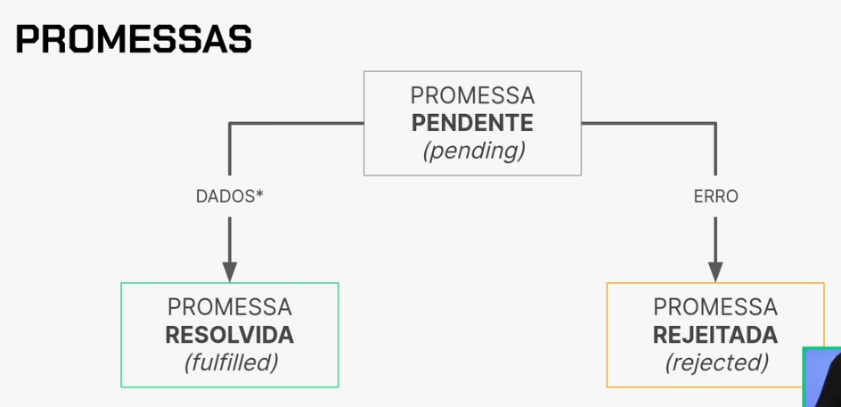

## Caminho absoluto

Chamamos de caminho absoluto quando a localização de um arquivo ou pasta é especificado a partir do diretório-raiz do sistema operacional. Por exemplo:

```
#caminho para um diretório (a última `/` é opcional)
/home/juliana/Documents/alura/projeto-js

#caminho para um arquivo dentro do diretório
/home/juliana/Documents/alura/projeto-js/index.js

```

## Caminho relativo

Um caminho relativo para um diretório ou arquivo é definido a partir de sua relação com o `pwd`, ou seja, o **present working directory** (diretório de trabalho atual). Na linha de comando, `pwd` também é o comando **print working directory** (imprimir o diretório de trabalho), que usamos justamente para saber onde na estrutura do sistema operacional se encontra o diretório em que estamos.

Veja no exemplo abaixo uma representação em árvore de um diretório, como o do curso em que estamos trabalhando (o diretório `node_modules` foi excluído para facilitar a leitura, pois é muito extenso):

```
/home/juliana/Documents/nodejs-lib
.
├── arquivos
│   ├── texto-aprendizado.txt
│   ├── texto-kanban.txt
│   └── texto-web.txt
├── lib
│   ├── index.js

```

Na representação acima, consideramos como `pwd` o diretório `nodejs-lib`. Então, o caminho relativo do arquivo `texto-web.txt`, por exemplo, seria `./arquivos/texto-web.txt`, e o caminho absoluto seria `/home/juliana/Documents/texto-web.txt`.

## Caracteres de escape:

Alguns exemplos de caracteres de escape:

- `\'` insere aspas simples
- `\"` insere aspas duplas
- `\\` insere barra invertida
- `\n` insere nova linha (new line)
- `\r` insere nova linha (carriage return)
- `\t` insere tabulação
- `\b` insere backspace

Para finalizar "fim de linha" ou "quebra de linha", existem alguns caracteres diferentes e diferentes sistemas operacionais utilizam estes caracteres de formas diferentes ao interpretarem textos.

- Em sistemas Unix e Unix-like (como o Linux) o caractere usado é `\n` (_new line_).
- `\n` também é caractere de escape padrão para quebra de linha em todas as linguagens baseadas em C (é o caso do JavaScript).
- Em sistemas Windows, a quebra de linha usa o caractere `\r`, ou *carriage return*. O nome vem das antigas máquinas de escrever em que o posicionamento da peça responsável por imprimir as letras (carro ou *carriage* em inglês) era feito manualmente a cada fim de linha.

Para finalizar "fim de linha" ou "quebra de linha", existem alguns caracteres diferentes e diferentes sistemas operacionais utilizam estes caracteres de formas diferentes ao interpretarem textos.

- Em sistemas Unix e Unix-like (como o Linux) o caractere usado é `\n` (_new line_).
- `\n` também é caractere de escape padrão para quebra de linha em todas as linguagens baseadas em C (é o caso do JavaScript).
- Em sistemas Windows, a quebra de linha usa o caractere `\r`, ou *carriage return*. O nome vem das antigas máquinas de escrever em que o posicionamento da peça responsável por imprimir as letras- Em antigos sistemas Mac (anteriores ao macOS X) o padrão era `\r\n`, nessa ordem.
- A diferença não é apenas no caractere: `\n` representa o fim de uma linha, o que para Linux e Mac é o equivalente a começar uma nova linha de texto. Já `\r` move o cursor para o início de uma nova linha (como a máquina de escrever).

É **muito importante** entender a forma como os sistemas operacionais e as linguagens "encodam" (ou interpretam) os caracteres em uma string para transformá-los em texto, pois as diferenças podem causar bugs de interpretação de caracteres onde menos se espera. (carro ou *carriage* em inglês) era feito manualmente a cada fim de linha.

Durante a aula praticamos a manipulação de arrays e objetos usando duas abordagens:

- `filter` e `map`
- `flatMap`

Porém, ainda há uma terceira abordagem para a resolução desse problema muito comum em programação: **como suprimir objetos vazios de um array de objetos**. Para isso, vamos usar o método de array [`reduce`](https://developer.mozilla.org/pt-BR/docs/Web/JavaScript/Reference/Global_Objects/Array/Reduce).

Durante a aula praticamos a manipulação de arrays e objetos usando duas abordagens:

- `filter` e `map`
- `flatMap`

Porém, ainda há uma terceira abordagem para a resolução desse problema muito comum em programação: **como suprimir objetos vazios de um array de objetos**. Para isso, vamos usar o método de array [`reduceO funcionamento básico do `reduce` é percorrer todos os índices de um array e "reduzir" seus valores a um único valor de retorno. Por exemplo:

```
const numeros = [1, 2, 3, 4, 5];

const result = numeros.reduce((acum, atual) => acum + atual, 0);

console.log(result); //15

```

No exemplo acima, usamos `reduce` para reduzir um array de números até a soma de todos eles, começando a contagem em `0` e somando os parâmetros da função callback a cada iteração (valor acumulado + valor atual).

Porém, o `reduce` também tem muitos usos mais complexos para arrays de objetos e pode nos ajudar a resolver o problema dos objetos vazios.

Observe abaixo uma versão mais curta da solução feita com `filter` e `map`:

```
const paragrafos = ["código", "js", "", "web", "", "array"];

const result = paragrafos
 .filter((paragrafo) => paragrafo)
 .map((paragrafo) => {
   if (paragrafo) return paragrafo;
 });
console.log(result);

```

Agora, vamos analisar uma abordagem utilizando `reduce`:

```
const paragrafos = ["código", "js", "", "web", "", "array"];

const result = paragrafos.reduce((acum, paragrafo) => {
 if (paragrafo) {
   return [...acum, paragrafo];
 }
 return acum;
}, []);

console.log(result);

```

Acompanhe os passos de desenvolvimento do código acima:

1.  Queremos "reduzir" o array atual a um outro array, então iniciamos `reduce` com um valor atual de `[]` (um array vazio).
2.  Os parâmetros da função callback são `acum` (em que são armazenados os valores já processados) e `paragrafo`, que se refere ao parágrafo sendo processado a cada iteração.
3.  A condicional `if (paragrafo)` avalia a string `paragrafo` em termos booleanos (lembrando de valores truthy e falsy) e apenas entra no `if` caso `paragrafo` **não** seja uma string vazia.
4.  Caso não seja uma string vazia, o código dentro do bloco `if` utiliza o **spread operator** (operador de espalhamento) para retornar um array composto dos valores anteriores (`acum`) "espalhados" em um novo array com o conteúdo do parágrafo atual.
5.  Caso seja uma string vazia, o código do bloco `if` não será executado, e o loop do `reduce` irá passar direto para o próximo elemento do array, ignorando a string vazia e a deixando de fora do array final.
6.  Após percorrer todos os elementos, o resultado final de `acum` será um array composto apenas de strings "não vazias" (avaliadas como `truthy` na condicional `if`).

**Qual método utilizar?** Apesar de o método `reduce` construir um novo array a cada iteração, a não ser que se trate de textos e arrays muito grandes, não deve haver muita diferença de performance entre os métodos.`](https://developer.mozilla.org/pt-BR/docs/Web/JavaScript/Reference/Global_Objects/Array/Reduce).

# Stack Trace

O stack trace é uma lista de todas as funções que foram chamadas até chegar no erro. Ele é muito útil para entender o que aconteceu e onde o erro ocorreu.

# Importações

No node a importação de módulos é feita através do require, e a exportação de módulos é feita através do module.exports, isso de forma nativa, sem a necessidade de instalar nada.
Entretanto, podemos utilizar um Import e Export mais moderno, rodando o comando `npm init -y` para criar o arquivo package.json e depois rodando o comando `npm install esm` para instalar o módulo esm, que nos permite utilizar o import e export mais moderno.
No package.json, no campo "type" colocamos "module" e no arquivo que queremos utilizar o import e export, colocamos `import fs from "fs";` e `export default wordsCount;`.

# Promessas [código síncrono e assíncrono]

Geralmente, o código assíncrono é utilizado em casos de:

- Leitura/manipulação de arquivos em disco
- Comunicação entre cliente e servidor
- Operações em banco de dados



Durante a aula praticamos a manipulação de arrays e objetos usando duas abordagens:

- `filter` e `map`
- `flatMap`

Porém, ainda há uma terceira abordagem para a resolução desse problema muito comum em programação: **como suprimir objetos vazios de um array de objetos**. Para isso, vamos usar o método de array [`reduceO funcionamento básico do `reduce` é percorrer todos os índices de um array e "reduzir" seus valores a um único valor de retorno. Por exemplo:

```
const numeros = [1, 2, 3, 4, 5];

const result = numeros.reduce((acum, atual) => acum + atual, 0);

console.log(result); //15

```

No exemplo acima, usamos `reduce` para reduzir um array de números até a soma de todos eles, começando a contagem em `0` e somando os parâmetros da função callback a cada iteração (valor acumulado + valor atual).

Porém, o `reduce` também tem muitos usos mais complexos para arrays de objetos e pode nos ajudar a resolver o problema dos objetos vazios.

Observe abaixo uma versão mais curta da solução feita com `filter` e `map`:

```
const paragrafos = ["código", "js", "", "web", "", "array"];

const result = paragrafos
 .filter((paragrafo) => paragrafo)
 .map((paragrafo) => {
   if (paragrafo) return paragrafo;
 });
console.log(result);

```

Agora, vamos analisar uma abordagem utilizando `reduce`:

```
const paragrafos = ["código", "js", "", "web", "", "array"];

const result = paragrafos.reduce((acum, paragrafo) => {
 if (paragrafo) {
   return [...acum, paragrafo];
 }
 return acum;
}, []);

console.log(result);

```

Acompanhe os passos de desenvolvimento do código acima:

1.  Queremos "reduzir" o array atual a um outro array, então iniciamos `reduce` com um valor atual de `[]` (um array vazio).
2.  Os parâmetros da função callback são `acum` (em que são armazenados os valores já processados) e `paragrafo`, que se refere ao parágrafo sendo processado a cada iteração.
3.  A condicional `if (paragrafo)` avalia a string `paragrafo` em termos booleanos (lembrando de valores truthy e falsy) e apenas entra no `if` caso `paragrafo` **não** seja uma string vazia.
4.  Caso não seja uma string vazia, o código dentro do bloco `if` utiliza o **spread operator** (operador de espalhamento) para retornar um array composto dos valores anteriores (`acum`) "espalhados" em um novo array com o conteúdo do parágrafo atual.
5.  Caso seja uma string vazia, o código do bloco `if` não será executado, e o loop do `reduce` irá passar direto para o próximo elemento do array, ignorando a string vazia e a deixando de fora do array final.
6.  Após percorrer todos os elementos, o resultado final de `acum` será um array composto apenas de strings "não vazias" (avaliadas como `truthy` na condicional `if`).

**Qual método utilizar?** Apesar de o método `reduce` construir um novo array a cada iteração, a não ser que se trate de textos e arrays muito grandes, não deve haver muita diferença de performance entre os métodos.`](https://developer.mozilla.org/pt-BR/docs/Web/JavaScript/Reference/Global_Objects/Array/Reduce).Além do `.then()` e do `async/await`, que são necessários quando nosso código executa métodos ou funções **definidas como assíncronas** (como no caso dos métodos `fs.promises.writeFile` ou `fs.promises.readFile` do Node.js), existem outras formas de se trabalhar com promessas.

## `Promise.all`

No nosso projeto recebemos o endereço de um arquivo `.txt` por vez e processamos apenas este arquivo usando o método `fs.readFile()`.

E o que aconteceria se, ao invés de apenas um arquivo, tivéssemos uma lista de diversos arquivos para serem processados?

Aqui entra um dos métodos de promessas do JavaScript, o [`Promise.all()`](https://developer.mozilla.org/pt-BR/docs/Web/JavaScript/Reference/Global_Objects/Promise/all).

Este método recebe um **iterável**, como um array, e retorna uma única promessa após todos os itens no array forem percorridos. O conteúdo dessa única promessa, após resolvida, é um array com os valores esperados (em caso de sucesso). O método irá retornar uma promessa rejeitada caso qualquer um dos itens do array não se resolva com sucesso.

Vamos analisar o exemplo:

```
async function lerMultiplosArquivos(arrayDeCaminhos) {
 try {
 const arrayDePromessas = arrayDeCaminhos
   .map((caminho) => fs.promises.readFile(caminho, "utf-8")
 );
   const listaDeDados = await Promise.all(arrayDePromessas);
   return listaDeDados;
 } catch (erro) {
   throw erro;
 }
}

```

Confira os passos da função `lerMultiplosAquivos`:

1.  A função recebe como parâmetro um array de caminhos de arquivo.
2.  O código `arrayDeCaminhos.map()` vai executar o método `fs.promises.readFile()` para cada um dos caminhos. Nesse momento, como não usamos `then` nem `async/await`, o valor retornado para cada um e guardado na variável `arrayDePromessas` será literalmente um array contendo objetos `Promise` ainda não resolvidos.
3.  A partir deste array de promessas, o método `Promise.all` se encarrega de resolver cada uma delas e retornar o resultado esperado para dentro da variável `listaDeDados`.

Executando a função utilizando `then`:

```
const caminhos = [
 "./arquivos/texto-kanban.txt",
 "./arquivos/texto-web.txt",
 "./arquivos/texto-aprendizado.txt",
];

lerMultiplosArquivos(caminhos)
 .then((conteudoDosArquivos) => {
   console.log(conteudoDosArquivos);
   // Aqui podem ser processados os conteúdos de cada arquivo
 })
 .catch((erro) => {
   console.error('Erro ao ler arquivos', erro.message);
 });

```

Ou podemos refatorar a função para usar `async/await`:

```
const caminhos = [
 "./arquivos/texto-kanban.txt",
 "./arquivos/texto-web.txt",
 "./arquivos/texto-aprendizado.txt",
];

async function lerMultiplosArquivos(arrayDeCaminhos) {
 const arrayDePromessas = arrayDeCaminhos.map(
   async (caminho) => await fs.promises.readFile(caminho, "utf-8")
 );
 const conteudosDosArquivos = await Promise.all(arrayDePromessas);
 return conteudosDosArquivos;
}

lerMultiplosArquivos(caminhos);

```

Esse método é bastante útil quando é necessário interagir com mais de um arquivo (por exemplo, todos os arquivos em uma pasta) ou quando devemos acessar diversas URLs.

## O construtor `Promise()`

Quando há métodos que sabemos que retornam promessas (por exemplo, o `fs.promises.writeFile`) e precisamos utilizá-los em nosso código, usamos `then` ou `async/await`. Isso serve tanto para métodos nativos do Node.js ou de diversas outras bibliotecas e frameworks que vamos usar no dia a dia para buscar dados em bancos de dados, acessar URLs, manipular arquivos, fazer grandes processamentos de muitos dados, operações em nuvem etc.

Além disso, podemos também usar o construtor [`Promise()`](https://developer.mozilla.org/en-US/docs/Web/JavaScript/Reference/Global_Objects/Promise/Promise) para escrever do zero nossas próprias promessas e também indicar como resolvê-las.

O `Promise` também é usado para resolver casos de encadeamento de promessas mais complexas ou para interagir com bibliotecas e APIs que usam callbacks em seus métodos assíncronos ao invés do objeto `Promise`.

Vamos ver um exemplo de função que recebe um valor booleano (`true` ou `false`) e com base nesse valor retorna uma `new Promise()` rejeitada ou realizada.

```
function promessa(bool) {
 const x = bool;
 return new Promise((resolve, reject) => {
   if (!x) {
     reject(new Error("falha na promessa"));
   }
   resolve("sucesso na promessa");
 });
}

function exibeResposta(textoResult) {
 console.log(textoResult);
}

promessa(true)
 .then((texto) => exibeResposta(texto))
// sucesso na promessa

```

Veja que a função `promessa()` cria uma nova promessa a partir do construtor `new Promise()` e com dois parâmetros: `resolve` e `reject`. `Promise()` precisa trabalhar sempre com estes dois parâmetros, que devem ser invocados após a resolução (com ou sem sucesso).

Neste caso, passamos um texto como parâmetro de cada um deles. Quando executamos a função `promessa(true)` este valor é carregado através das promessas até ser passado para a função `exibeResposta(textoResult)`, que por fim vai exibir a mensagem correta. No caso de `promessa(false)`, além da mensagem "falha na promessa" o Node.js também vai lançar no terminal a stack trace do objeto `Error`.

Assim, concluímos que sempre temos que ter em mente os estados possíveis de qualquer promessa em JavaScript:

1.  Promessas podem ser concluídas de duas formas: *fulfilled* (realizada, completa) ou *rejected* (rejeitada). Isso equivale a duas situações possíveis: a promessa se concretizou (retornou os dados ou executou o código que deveria) ou não.
2.  Promessas que não estão *fulfilled* nem *rejected* estão *pending* (pendentes), ou seja, ainda não é possível saber o resultado final porque o processamento ainda não foi concluído.
3.  Após a finalização do processamento, a promessa passa para o estado de *settled* (concluída), independente do resultado.
4.  Uma vez que a promessa está *settled* seu resultado não se altera mais, ou seja, uma promessa que se concluiu como *rejected* não muda mais para o estado de *fulfilled* e vice-versa.

## Callbacks

Vamos relembrar o primeiro método de *file system* que utilizamos, o `readFile()`:

```
 fs.readFile(texto, 'utf-8', (erro, texto) => {
   try {
     if (erro) throw erro
     const resultado = contaPalavras(texto);
     criaESalvaArquivo(resultado, destino)
   } catch(erro) {
     trataErros(erro);
   }
 })

```

Ao consultarmos a [documentação do Node.js sobre o método callback](https://nodejs.org/api/fs.html#fsreadfilepath-options-callback), temos a informação que `fs.readFile` *asynchronously reads the entire contents of a file* ou **lê assíncronamente todo o conteúdo de um arquivo** (em tradução livre).

Mas se já existe esse método, qual o motivo de existir o método adicional [`fs.promises.readFile()`](https://nodejs.org/api/fs.html#fspromisesreadfilepath-options) e também o método síncrono [`fs.readFileSync()`](https://nodejs.org/api/fs.html#fsreadfilesyncpath-options)?

Funções callback são a forma "pré-ES6" de o JavaScript manejar operações assíncronas. Internamente, o funcionamento de uma função callback envolve a chamada (ou execução) da função interna após a finalização da função mais externa, quando os dados resultantes são passados como parâmetro.

> O ES6 (EcmaScript 6 ou, ainda, JavaScript 2015) foi uma das atualizações mais importantes da linguagem e implementou diversas funcionalidades do que chamamos de "JavaScript moderno".

Por exemplo:

```
fs.readFile('/pasta/texto.txt', (erro, texto) => {
  if (erro) throw erro;
  console.log(texto);
});

```

No código acima, o método `fs.readFile` é executado com o parâmetro `'/pasta/texto.txt'`. Após o término desse primeiro processamento, os dados retornados pelo método são passados via parâmetro (`texto` em caso de sucesso ou `erro` em caso de erro) para dentro da função callback anônima.

Dessa forma, é possível afirmar que a função callback "aguarda" a finalização da função externa para somente então executar com os dados recebidos por parâmetro.

## Promises

O ES6 trouxe a funcionalidade **Promise** (ou promessa), um objeto que representa a eventual resolução de um processamento assíncrono.

Vamos relembrar o método `fs.promises.writeFile()` usado no curso:

```
   await fs.promises.writeFile(arquivoNovo, textoPalavras);

```

Este método faz o processamento assíncrono *baseado em promessas*. Ou seja, ao invés de uma função callback, a função pode receber apenas os parâmetros necessários. O uso do `async/await` (ou `then`) possibilitará a resolução das promessas e retorno dos dados esperados (ou do erro).

## Qual método utilizar?

As promessas são a forma mais "moderna" de trabalhar com operações assíncronas em JavaScript, possibilitando a escrita de código mais limpo, legível e desacoplado.

Callbacks ainda podem ser (e são) utilizadas, especialmente em contextos nos quais as funções devem executar tarefas mais simples, ou seja, sem tratamento complexo de erro e sem encadeamento de funções. Além disso, há muitas bibliotecas que utilizam "código legado" composto por funções callback, que ainda podem ser utilizadas.

Já Promises, além de serem a opção mais atual e moderna, têm uma forma mais estruturada de fazer o tratamento de erros com `try/catch`, uma estrutura que facilita o encadeamento de funções quando necessário (com o uso do `then`) e também permitem código mais limpo e organizado com `async/await`. Assim, podem ser utilizadas de forma mais produtiva quando é necessário lidar com fluxos assíncronos mais complexos e tratamento de erros mais robusto.

Sempre que vamos trabalhar com um projeto em Node.js do zero, uma das primeiras coisas que fazemos é criar um arquivo `package.json` utilizando o comando `npm init`; assim como para todas as instalações de libs externas utilizamos o comando `npm install <nome do pacote>`.

O NPM é o que chamamos de **gerenciador de pacotes**, sendo NPM o acrônimo de **_Node Package Manager_** ou Gerenciador de Pacotes do Node.

## Mas o que são exatamente estes gerenciadores?

Gerenciadores de pacotes são repositórios de código aberto nos quais devs disponibilizam soluções para o uso da comunidade. Estas soluções são programas que outras pessoas desenvolveram e que utilizamos para ganhar tempo no desenvolvimento de nosso próprio código, e vão desde *libs* (bibliotecas) pequenas e específicas até frameworks com vários recursos prontos. Pacote é como chamamos o conjunto do código que determinada lib ou framework utiliza para executar.

Algumas dessas bibliotecas são criadas por times de desenvolvimento para resolver algum problema específico que tiveram que enfrentar. Depois elas são disponibilizadas para que outras pessoas com o mesmo contratempo aproveitem e também utilizem. Outras são disponibilizadas por empresas de software que utilizam as plataformas dos gerenciadores (como o NPM) para a distribuição de suas soluções de código. Por serem de código aberto, isso significa que você também pode criar e publicar a sua lib para outras pessoas baixarem e instalarem em seus projetos.

Além do NPM, outro gerenciador muito utilizado em projetos Node.js é o [Yarn](https://yarnpkg.com/), criado em 2016 com a proposta de resolver algumas questões do NPM, especialmente as relacionadas à performance e segurança. Hoje, ambos os gerenciadores são bastante utilizados, porém, o NPM ainda é o gerenciador padrão disponibilizado com a instalação do Node.js.

## Instalação local vs global

Estes pacotes de código podem ser instalados **localmente**, estando disponíveis somente para o projeto no qual foi instalado através da pasta `node_modules`, e **globalmente**, sendo instalados em um diretório geral do NPM e ficando disponíveis para todos os projetos em seu computador, sem a necessidade de instalar separadamente em cada projeto.

**Na maior parte das vezes, você vai utilizar a opção local**, com os comandos `npm install <nome do pacote>` ou `yarn add <nome do pacote>`, pois fica mais fácil gerenciar a versão das libs que utilizamos e é muito comum que um pacote que instalamos "puxe" um ou vários outros pacotes auxiliares que ele precisa para funcionar internamente, o que pode acabar "inflando" a pasta global do `node_modules`. O ideal é não poluir este diretório global com libs que em alguns casos serão utilizadas em somente um projeto.

Já algumas libs e frameworks mais complexas vão solicitar que a instalação seja feita globalmente para funcionar. Sempre vale a pena consultar a documentação de cada uma. Para fazer uma instalação global de pacotes, utilizamos os comandos `npm install -g <nome do pacote>` ou `yarn add global <nome do pacote>`. Novamente, recomendamos que essa opção só seja utilizada **quando indicada de forma expressa na documentação do framework ou biblioteca**.

> A recomendação é que a instalação de pacotes seja feita **sempre localmente** (sem o `-g`) e que a instalação global só seja feita em casos específicos -- normalmente a documentação da ferramenta vai informar se isso é necessário.

# Versões de bibliotecas e software

Todos os softwares que trabalhamos em nosso curso, inclusive o próprio Node.js e o NPM, têm algo em comum: trabalham com o conceito de **versionamento semântico**.

Você já deve ter notado que as sequências numéricas das versões de todos eles seguem o mesmo padrão de três números separados por pontos, por exemplo `1.0.0` (a versão inicial que o `package.json` cria) ou `20.11.0` (última versão recomendada do Node.js no momento em que este texto foi escrito). O que significa cada número desta sequência?

O versionamento semântico utiliza os seguintes critérios:

- O primeiro número da sequência (o `20` em `20.11.0`) se refere a **breaking changes**, ou seja, atualizações de versão que têm potencial para "quebrar" códigos que utilizem as versões anteriores. Ou seja, uma aplicação que utiliza códigos (métodos, funções etc.) da versão `18.X.X` de determinada lib pode deixar de funcionar com a versão `20.X.X`, pois haverá diferenças significativas entre as versões. Estas atualizações são conhecidas como `major` (ou "maiores", em tradução livre).
- O número do meio (o `11` em `20.11.0`) se refere a novas funcionalidades adicionadas, mas que não causam "quebra" em relação a códigos das versões anteriores. Este tipo de atualização é conhecida como `minor` (ou "menores").
- O último número (o `0` em `20.11.0`) se refere à correção de código: resolução de bugs, melhoramento de performance ou alterações similares que não alteram as funcionalidades atuais (com exceção da correção de bugs) nem introduzem novas. É conhecida como `patch` (que pode ser traduzido como "remendo").

À medida que um sistema ou biblioteca cresce, se integra com outras, resolve bugs e adiciona funcionalidades, mais importante se torna a adoção de um padrão que documente essas mudanças, especialmente com relação às *breaking changes*. Uma atualização não planejada em toda uma funcionalidade baseada nesta biblioteca, em outro sistema, pode quebrar completamente. Por isso a convenção é tão importante e é seguida à risca por todo e qualquer time de desenvolvimento.
